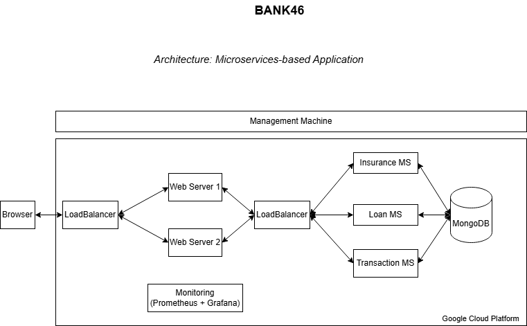

# Capstone Project 

The project's objective is to implement a simple and functional web application based on microservices. 

## Bank46


## Description

**Bank46** is our cloud-powered banking web application, entailing the use of automation tools, designed to manage core microservices such as Insurance, Loan, and Transaction processing.

## Architecture



## Setup

- **Vagrant Setup**: The deployment process starts by using Vagrant to create a virtual machine (mgmt) for management purposes. Running the command ```vagrant up mgmt``` initiates the 'Vagrantfile' and the 'bootstrap-mgmt.sh' script that set up the management environment. 

- **SSH Access**: Once the management VM is up, the next step is to access it via SSH using ```vagrant ssh mgmt```. Inside this VM, you'll navigate to the '/gcp' directory, where the GCP deployment process is managed.

- **Generate SSH Keys and login into GCP**: After accessing the management machine, you generate the necessary SSH keys for authenticating with GCP services using ```ssh-keygen -t rsa -b 2048```. Also, using ```gcloud auth login```, the auth process with the gcp will be completely established.
	
- **Terraform Setup**: Inside the /gcp directory, you’ll configure Terraform to use the correct service account JSON key, project ID and region for GCP. 
The following Terraform steps are then executed:
     - ```terraform init``` to initialize the Terraform workspace.
     - ```terraform plan``` to preview the infrastructure changes.
     - ```terraform apply``` to deploy the infrastructure components including the microservices, load balancer, web servers, monitors and the database . This step uses several Terraform configuration files.

- **Configuring Hosts**: Once the infrastructure is deployed, you run ```terraform output``` to get the IP addresses and update 'gcphosts' files accordingly **(done automatically by our script)** to ensure proper connectivity to the GCP instances.

- **Ansible Configuration**: Finally, Ansible is used to configure the servers and deploy the microservices. Run ```ansible-playbook 'name of the machine'```  to configure all the machines. Ansible uses the 'ansible.cfg' configuration file and credentials from 'ansible-load-credentials.sh' to proceed the setup. Once the playbooks are executed, the web servers load and display the JavaScript templates, completing the deployment process.

## Advanced Component

- **Part I – Load Balancing**: 
Traffic is managed using load balancing across both web servers and microservices, implemented with HAProxy using the roundrobin mechanism. This is set up via an Ansible playbook on the load balancer machine, which is deployed using Terraform, that calls the haproxy config file. The load balancer distributes requests efficiently, ensuring optimal performance and availability.
- **Part II - Database backend service with persistent storage**: 
A database backend service with persistent storage is employed to store data. Terraform deploys a MongoDB instance, which is then configured via an Ansible playbook. Each microservice connects to the database using individual Mongoose connections and schemas, since the business logics are different. This ensures that all endpoints are interrelated and can interact with the database.

## Report

[Report](docs/project-g46.odt)

## Video

TODO

[Video](yt)

## Contributing

Paulo Bolinhas

Rui Martins
